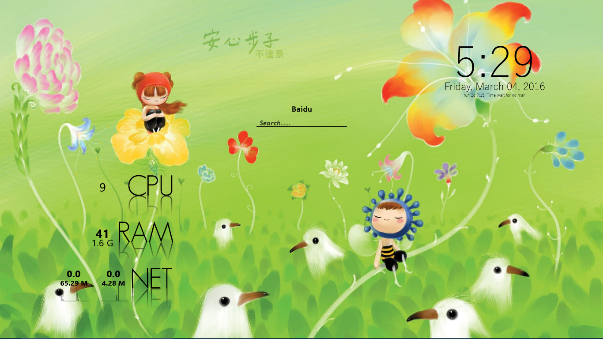

# MSuit
 自用Rainmeter主题。显示时间、日期、内存、CPU、网络、电量等信息。
 * 检测壁纸，自适应主题色；自适应显示屏分辨率
 * 显示日期、时间、开机时间及一句格言
 * 检测并显示CPU使用率，并在高负荷时变色
 * 检测并显示上传、下载速度（单击暂停）；显示累计总流量（双击重置或每天第一次刷新自动重置）
* 检测并显示电量和适配器连接情况，并在低电量时变色；在适配器断开时声音提醒；皮肤在适配器连接且电量100时自动隐藏；悬停显示IP及信号强度
* 检测并显示RAM使用量及使用率，并在高负荷时变色
* 桌面搜索部件
* 简单的倒数日部件  

